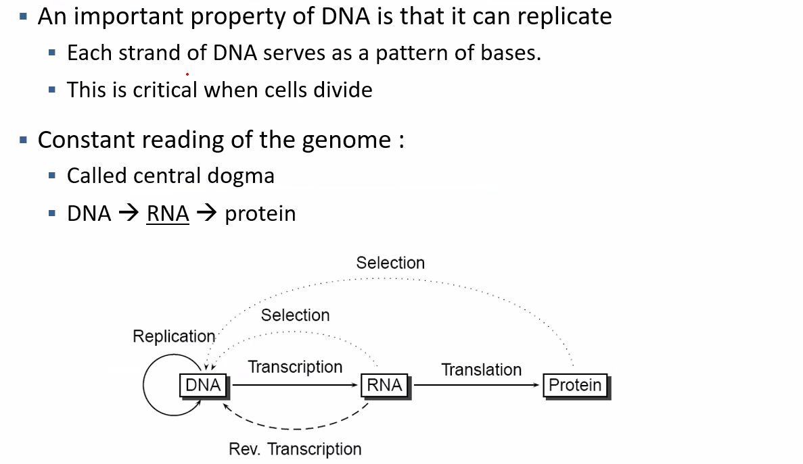
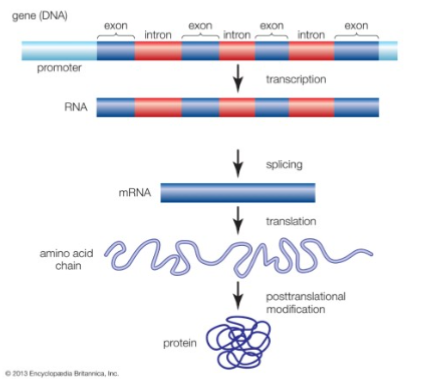

# R for Bioinformatics

## Introduction

Bioinformatics is an evolving field that combines biology, computer science, and data analysis to interpret biological
data. This repository is designed to offer a comprehensive entry-level introduction to bioinformatics, integrating both
theoretical knowledge and hands-on experience using the R programming language through small-scale projects. The
emphasis will be on analyzing biological sequences (DNA, RNA, protein) and exploring their real-world applications.

For more detailed information, please refer to the `Report.PDF` found in each folder of this repository.

- More
  references: [Computational Biology by Scott T. Kelley](https://www.barnesandnoble.com/w/computational-biology-scott-t-kelley/1133679834#:~:text=Computational%20Biology:%20A%20Hypertextbook,%20by%20Scott%20Kelley%20and,are%20integrated%20to%20form%20a%20complete%20educational%20resource.)
- [A Little Book of R for Bioinformatics](https://buildmedia.readthedocs.org/media/pdf/a-little-book-of-r-for-bioinformatics/latest/a-little-book-of-r-for-bioinformatics.pdf)
- FASTA files can be downloaded from [NCBI](https://www.ncbi.nlm.nih.gov/)


## Understanding DNA

Deoxyribonucleic acid (DNA) is the fundamental molecule that stores genetic information for most living organisms. DNA
consists of nucleotides arranged in a double helix structure and encodes the instructions for cell function, growth, and
reproduction. In humans, the entire set of genetic information, known as the genome, contains approximately 3 billion
nucleotides. Decoding and understanding this molecular information allow us to learn more about how organisms function
and interact.

While DNA encodes all the instructions, it is not a protein. Proteins are synthesized based on the instructions found in
DNA.

## The Central Dogma



## Genes

A gene is the basic physical and functional unit of heredity. Genes vary in size from a few hundred DNA bases to over 2
million bases. The Human Genome Project estimates that humans have between 20,000 and 25,000 genes.



[**Exercise 1**]()

## Proteins

Some genes act as instructions for making molecules called proteins:

- Structural proteins contribute to our tissues (e.g., bones, muscles).
- Enzymes participate in chemical reactions, like breaking down food.
- Messenger proteins, such as hormones, send signals throughout the body.

Scientists assign unique names or symbols to genes (e.g., CFTR). Proteins are responsible for forming everything in our
body—hair, nails, skin—and regulating how well our body produces proteins.

### Technologies Involved

- Bioinformatics
- Machine Learning
- Data Visualization
- HTML & CSS
- Artificial Intelligence
- Data Analysis & Exploration (min, max, mean, standard deviation, correlation)
- Data Transformation
- Plotting Methods
- Principal Component Analysis (PCA)
- Eigen Vectors
- Hopkins Statistic
- Confusion Matrix
- Clustering Methods
- Predictive Models

## Getting Started

These instructions will help you set up the project on your local machine for development and testing purposes.

### Data

Each project contains its own dataset and a `README` file.

### Prerequisites

To work on this project, you’ll need:

- **R CRAN Project**: A software environment for statistical computing and
  graphics. [Download here](https://www.r-project.org/).
- **RStudio IDE**: A powerful integrated development environment (IDE) for
  R. [Learn more here](https://rstudio.com/products/rstudio/).
- **Bioconductor Package**: A repository of tools for bioinformatics in
  R. [Install here](https://bioconductor.org/install/).

### Installation Steps

1. **Install R**: [Click here to download R](https://www.r-project.org/).
2. **Install RStudio IDE
   **: [Download the free desktop version here](https://rstudio.com/products/rstudio/#:~:text=RStudio%20Take%20control%20of%20your%20R%20code%20RStudio,tools%20for%20plotting,%20history,%20debugging%20and%20workspace%20management).
3. **Install Bioconductor**: Follow the instructions for Bioconductor package
   installation [here](https://bioconductor.org/install/).

## Running the Tests

### Data Import

To run automated tests on this system:

1. Open RStudio and create a new project.
2. Copy the source folder (`src`) and markdown file (`.rmd`) into the project directory. For example:
    ```R
    ~/Bioinformatics_Project/markdown.rmd
    ~/Bioinformatics_Project/data.csv
    ```
3. Organize the dataset into a subdirectory for better structure:
    ```
    ~/Bioinformatics_Project/data/data.csv
    ```
4. Update the import path as necessary:
    ```R
    Rdata <- read.csv("~/R/DataMining/Bioinformatics_Project/data/data.csv", header=TRUE)
    ```