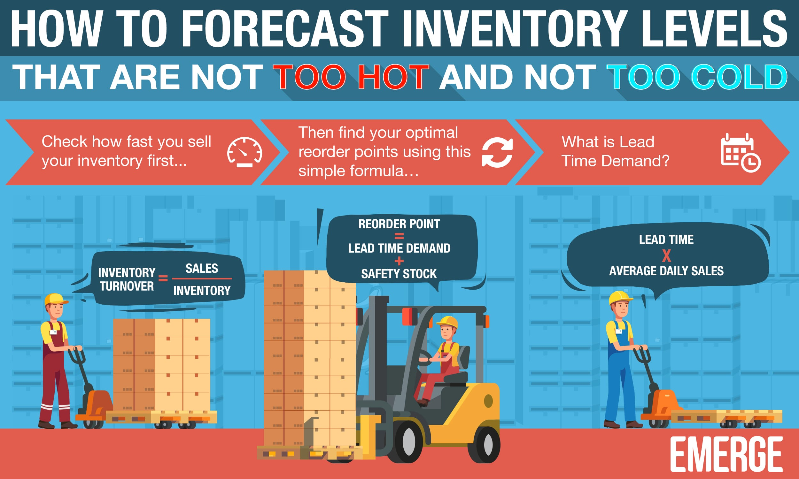
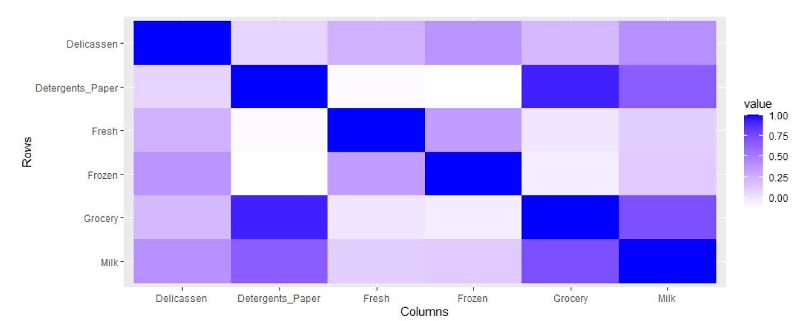
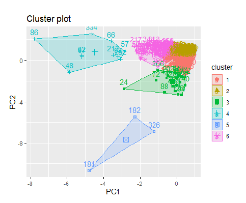

# Sales Inventory Prediction using Machine Learning

## Introduction

This project utilizes various machine learning models to classify data from a Wholesale database and predict future
inventory needs. The goal is to perform cluster analysis on the sample data, allowing data scientists to form hypotheses
and gain insights for decision-making. You can find the complete research
paper [here](https://github.com/jackyhuynh/data_science_and_visualization/blob/main/R_inventory_prediction/src/Markdown-WholeSale.pdf).



## Insights from the Data

The plot below reveals some interesting hypotheses. For example, customers who purchase groceries are almost certain to
also buy detergents and paper goods. Furthermore, those who buy detergents are 75% to 90% likely to buy milk as well. By
combining these insights with statistical analysis, businesses can make more informed decisions. For detailed statistics
and data analysis, please refer to the full research
paper [here](https://github.com/jackyhuynh/data_science_and_visualization/blob/main/R_inventory_prediction/src/Markdown-WholeSale.pdf).



### Technologies Used

- Business Analysis
- Machine Learning
- Data Mining
- Data Visualization

### Algorithms & Methods Employed

- **Data Exploration**: Use statistical functions to explore data characteristics such as min, max, mean, standard
  deviation, and correlations.
- **Data Transformation**: Standardize the dataset to address variations in magnitude.
- **Principal Component Analysis (PCA)**
- **Eigen Vectors**
- **Hopkins Statistic** (for clustering tendency)
- **Elbow Method** and **Silhouette Method** (for optimal cluster count)
- **Representative-based clustering**
- **Hierarchical clustering**
- **Density-based clustering**

## Getting Started

Follow these instructions to get a copy of the project running on your local machine for development and testing
purposes.

### Data

Download the dataset from [Kaggle](https://www.kaggle.com/truchuynh87/wholesalecustomersdata).

### Prerequisites

To run this project, you'll need:

- **R**: A software environment for statistical computing. You can download it [here](https://www.r-project.org/).
- **RStudio IDE**: An integrated development environment for R that offers tools for coding, plotting, and debugging.
  Learn more [here](https://rstudio.com/products/rstudio/).

### Installation Steps

1. Install [R](https://www.r-project.org/).
2. Install [RStudio](https://rstudio.com/products/rstudio/), and choose the desktop version.
3. Create a new RStudio project.
4. Place the data and Markdown file into your project directory, e.g.:
   ```
   ~/salePredictionSystem/markdown.rmd
   ~/salePredictionSystem/WholesaleCustomersData.csv
   ```
   Alternatively, you can store the data in a separate folder as follows:
   ```
   ~/salePredictionSystem/data/WholesaleCustomersData.csv
   ```
5. Update the data import path in the code if necessary:
   ```R
   WholesaleData <- read.csv("~/R/DataMining/WholeSale/data/WholesaleCustomersData.csv")
   ```

For detailed instructions on importing data in R, refer
to [this guide](https://support.rstudio.com/hc/en-us/articles/218611977-Importing-Data-with-RStudio?mobile_site=true).

### Data Visualization

Cluster analysis allows us to identify customer purchase patterns, helping businesses adjust their inventory levels
accordingly.



## Project Packaging and Distribution

### Python Virtual Environments

To manage your Python environment, avoid including unnecessary files in your repository by using a `.gitignore` file
with the following entries:

```bash
# Python environment directories
.env/
venv/
...

# IDE configurations (JetBrains, VSCode, etc.)
.idea/
.vscode/
...

# Logs and temporary files
*.log
*.sqlite3
```

This setup ensures that your environment stays clean and manageable.

---

This version improves readability and enhances the professionalism of the document, making it easier for others to
follow the instructions.